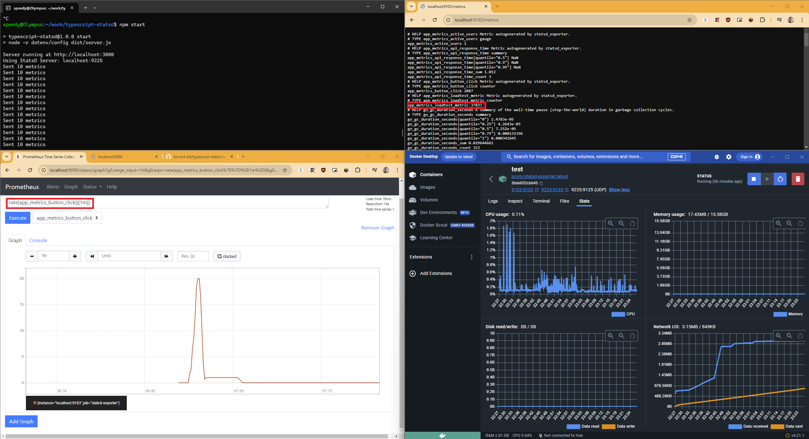

### **📜 README: Typescript StatsD Test App**
A complete guide to setting up **StatsD Exporter in Docker**, running the **TypeScript application**, and visualizing metrics in **Prometheus & Grafana**.

---

## **🚀 1. Overview**
This application simulates high-load scenarios by sending metrics to **StatsD Exporter** at a configurable rate. The data flows through **StatsD → Prometheus → Grafana**, where it can be visualized.

---

## **📦 2. Prerequisites**
Ensure you have the following installed:
- **Docker** & **Docker Compose** (For running StatsD Exporter)
- **Node.js 18+** (Use `nvm install 18` if needed)
- **npm** (Installed with Node.js)
- **Prometheus & Grafana** (For visualization)

---

## **🐳 3. Set Up StatsD Exporter in Docker**
StatsD Exporter converts **StatsD metrics** into **Prometheus format**.

1️⃣ **Create a Docker network (optional, if not using an existing one)**:
```sh
docker network create monitoring
```

2️⃣ **Run StatsD Exporter**:
```sh
docker run -d --name statsd-exporter \
  --network monitoring \
  -p 9125:9125/udp \
  -p 9102:9102 \
  prom/statsd-exporter
```
- **`-p 9125:9125/udp`** → Listens for StatsD UDP traffic  
- **`-p 9102:9102`** → Exposes Prometheus metrics  

---

## **📥 4. Clone the Repository & Install Dependencies**
1️⃣ **Clone the repo**:
```sh
git clone https://github.com/your-repo.git
cd your-repo
```

2️⃣ **Install dependencies**:
```sh
npm install
```

---

## **⚙️ 5. Configure `.env`**
1️⃣ Copy the example file:
```sh
cp .env.example .env
```

2️⃣ Edit **`.env`**:
```
STATSD_HOST=localhost
STATSD_PORT=9125
STATSD_PREFIX=app.metrics.
APP_PORT=3000
```

- **`STATSD_HOST=statsd-exporter`** (If running in **Docker network**)
- **`STATSD_HOST=localhost`** (If running directly on your machine)

---

## **🚀 6. Run the App**
### **Development Mode**
```sh
npm run dev
```
This starts the app with **live reload**.

### **Production Mode**
```sh
npm run build
npm start
```

---

## **📊 7. Verify Metrics in StatsD Exporter**
1️⃣ Send a **test metric** manually:
```sh
echo "test.metric:1|c" | nc -u -w1 localhost 9125
```

2️⃣ Check if **StatsD Exporter received it**:
```sh
curl -s http://localhost:9102/metrics | grep test_metric
```
✅ **Expected output**:
```
# HELP test_metric StatsD metric
# TYPE test_metric counter
test_metric 1
```

---

## **📡 8. Configure Prometheus**
1️⃣ **Open your Prometheus config file (`prometheus.yml`)**  
2️⃣ Add the StatsD Exporter as a scrape target:
```yaml
scrape_configs:
  - job_name: 'statsd'
    static_configs:
      - targets: ['localhost:9102']
```

3️⃣ **Restart Prometheus**:
```sh
sudo systemctl restart prometheus
```

4️⃣ **Query in Prometheus UI** 👉 [http://localhost:9090](http://localhost:9090)  
```
app_metrics_button_click
app_metrics_active_users
app_metrics_api_response_time
```

---

## **📊 9. Set Up Grafana Dashboard**
1️⃣ Open **Grafana** 👉 [http://localhost:3000](http://localhost:3000)  
2️⃣ **Add a Prometheus Data Source**  
   - URL: `http://localhost:9090`  
3️⃣ **Create a new dashboard**
4️⃣ Add panels with these queries:
   ```
   app_metrics_button_click
   app_metrics_active_users
   app_metrics_api_response_time
   ```
5️⃣ Save & monitor real-time data!

---

## **🛠 10. Debugging**
### **Check if StatsD Exporter is Running**
```sh
docker ps | grep statsd-exporter
```

### **View StatsD Exporter Logs**
```sh
docker logs -f statsd-exporter
```

### **Check if Metrics Are Being Received**
```sh
curl -s http://localhost:9102/metrics | grep app_metrics
```

---

[](pic/typescript_statsd_example.png)
## **✅ Summary**
- **StatsD Exporter** is running in **Docker** (`port 9125` UDP)
- **TypeScript App** is sending metrics to StatsD
- **Prometheus** is scraping metrics from **StatsD Exporter**
- **Grafana** visualizes real-time metrics
